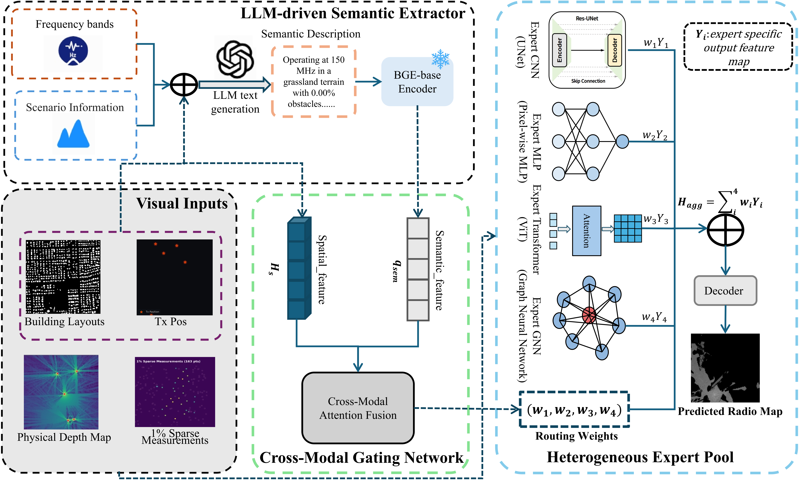

## Bridging Semantics and Signals: An LLM-Driven MoE Framework for Radio Map Prediction

The official implementation of "Bridging Semantics and Signals: An LLM-Driven MoE Framework for Radio Map Prediction". 

In this project, we introduce LLM-MoE, a framework that employs a divide-and-conquer Mixture-of-Experts (MoE) strategy and an LLM-driven semantic extractor to dynamically allocate modeling tasks to matched expert sub-networks (CNN, ViT, MLP, and GNN). By integrating macroscopic semantics with local spatial features, LLM-MoE effectively addresses the generalization bottlenecks of single-network models across diverse multi-band and multi-terrain scenarios for radio map prediction.

## Installation
### Environment
- Tested OS: Linux
- Python >= 3.8
- torch >= 2.0.0
- transformers >= 4.30.0
- openai >= 1.0.0
- numba >= 0.57.0

## Data
The data used for training and evaluation can be found in [SpectrumNet](https://spectrum-net.github.io/).
After downloading the data, move the `npz` folder (containing 3D/2D building topology maps), the `png` folder (containing ground truth radio maps), and the `tx_info.txt` file to `../SpectrumNet` (parallel to this repository).

Before training, you need to process the original data to generate the physical depth maps and extract LLM semantics:
1. Generate physical depth maps (Numba accelerated):
   `python prep_spatial_depth.py --data_root ../SpectrumNet`
2. Extract semantic descriptions via LLM (OpenAI API key required):
   `export OPENAI_API_KEY="your_api_key_here"`
   `python prep_llm_semantics.py --data_root ../SpectrumNet`

## Model Training

### Stage-1: Pre-training
- For pre-training the heterogeneous experts (CNN, ViT, DNN, GNN) independently, run: 
  `python train_experts.py`
- The pre-trained weights will be saved to `./Checkpoints_Stage1_MSE`.

### Stage-2 & 3: MoE Warm-up and Fine-tuning
- For MoE Cross-Modal Gating Network warm-up (Stage-2) and full end-to-end fine-tuning (Stage-3), run: 
  `python train_MoE.py`
- The best model weights will be saved to `./Checkpoints_MoE_TwoStage`.

## 📧 Contact

If you have any questions or want to use the code, feel free to contact:
* Qi Yang (qqyy@hnu.edu.cn)
* Tong Li (tliay@hnu.edu.cn)
* Zhu Xiao (Zhxiao@hnu.edu.cn)